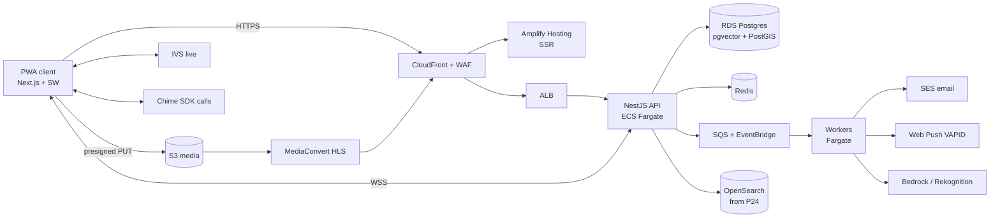

# Kinkord Build Blueprint — Everything Needed for the 200-Feature Plan

**Scope:** web app / PWA only · AWS · frontend + backend + everything self-built
**Timeline:** Aug 16, 2026 → Dec 28, 2027 · 50 phases × 10 days × 4 features
**Dev budget:** ₦100,000,000 (₦187k phase 1, +₦74k per phase — the arithmetic checks out exactly)
**Status:** Phase 1 is already running (Aug 16–25). This document is the infrastructure, stack, cost, team, and compliance breakdown for the whole program.

> FX assumption throughout: ₦1,500/$ — adjust to the current rate. AWS bills in USD, so naira depreciation directly raises infra cost in ₦.

---

## 1. Five hard truths before anything else

1. **The ₦100M does not include infrastructure.** It's a dev-payment schedule. AWS + third-party services over the 17 months will realistically total **$25k–90k (₦38M–135M)** depending on how hard the media phases (25–30) and AI phases (31+) get used. Infra must be budgeted separately, and AWS Activate credits applied for immediately.
2. **Payments are the single biggest business risk — not a feature, a company-existential dependency.** Mainstream PSPs (Stripe, Paystack, Flutterwave, PayPal) prohibit adult platforms. Phase 18–20 payment features require a high-risk/adult-friendly PSP (CCBill, Segpay, Verotel, Epoch class), whose onboarding takes 4–12 weeks, needs a registered entity + compliance docs, and costs 5–15% effective rates vs the 1.5–3% you'd expect. **Discovery must start now, not in February.**
3. **Age verification cannot wait until Phase 42.** An 18+ platform that accepts signups from Phase 1 needs age assurance at or near signup — legally (UK OSA, US state AV laws, EU DSA trends) and for platform safety. Move a basic age-verification gate to Phases 1–3; keep full KYC-for-payouts at Phase 42.
4. **The repo today cannot carry Phase 1.** Current state is a marketing site with Google Sheets as the data layer. Login/registration/password-recovery/profiles (due Aug 25) need Postgres, real auth, and a deployable API — that's this week's work.
5. **PWA-only is the right call — own it fully.** Apple's App Store and Google Play prohibit adult content, so native apps were never available. A PWA sidesteps the stores: installable from the browser, push notifications (iOS 16.4+ requires the user to Add to Home Screen first), offline shell, full-screen. Costs: no store discoverability (marketing carries acquisition), no native AR/background services, iOS push only after install. All acceptable for this product; design onboarding around "install the app" prompts.

---

## 2. Reading the plan

- **Phase-band structure** (how infra maps to the 50 phases):
  - **P1–14 · Foundation & Social Core** — auth, profiles, social graph, posts, feed, chat. Infra: the permanent skeleton (accounts, CI/CD, Postgres, Redis, S3/CDN, websockets, push).
  - **P15–24 · Education & Commerce** — Kinkopedia, courses, events/ticketing, subscriptions, wallet, marketplace, safety center. Infra: payments rails + ledger, search, moderation tooling.
  - **P25–30 · Matchmaking & Heavy Media** — matching, reels, video, calls, live streaming. Infra: transcode pipeline, live video, real-time calls. **This is where costs inflect.**
  - **P31–50 · AI, Enterprise, Global** — AI features, analytics/BI, public API, admin/mod dashboards, stories, forums, geo, business accounts, governance. Infra: Bedrock, warehouse, API gateway, hardening, selective scale-out.
- **Cadence reality:** 4 features/10 days is sustainable for CRUD-shaped features with AI-assisted development, but phases 18–20 (payments), 28–29 (calls/live), and 34 (public API) are not CRUD. The plan wisely pairs hard items with light ones; still, adopt **scope-flex** (a feature ships in reduced form rather than slipping the phase) as the standing rule, since dates and money are fixed per phase.

---

## 3. The stack (decisive picks)

TypeScript end-to-end. One language, one team, shared types.

| Layer | Pick | Why |
|---|---|---|
| Monorepo | pnpm workspaces + Turborepo | `apps/web`, `apps/admin`, `apps/api`, `packages/domain`, `packages/ui`, `infra/` |
| Frontend | Next.js (already in repo) + Tailwind + TS | Keep existing layering (views → presenters → services → repos per AGENTS.md) |
| PWA | Serwist service worker + Web App Manifest + Web Push (VAPID) | Installability, offline shell, push. Dexie/IndexedDB for offline cache |
| Client data | TanStack Query + Zustand; react-hook-form + zod | Boring, proven |
| Backend | **NestJS modular monolith** on ECS Fargate | Module boundaries per feature domain = "microservices-ready" without the ops tax. Feature 136 is satisfied by *extracting* hot modules (chat, media) only when metrics demand |
| Realtime | socket.io on Fargate + Redis adapter | Presence (012), typing (013), receipts (046), chat (042–052), live counters |
| API style | REST + OpenAPI internally; same spec becomes the public Developer API (134) with API Gateway usage plans | One contract, two audiences |
| Auth | **Better Auth** (self-hosted, Postgres, argon2) + TOTP 2FA plugin; passkeys later | Owns PII in your DB (matters for this community), 2FA (008) built-in, external IdPs (187) via plugins. Cognito is the managed fallback if you'd rather not own it |
| Primary DB | RDS PostgreSQL → Aurora Serverless v2 when spiky | + **pgvector** (AI matching/recs) + **PostGIS** (geo 092/102/153–155) + partitioned message tables from day 1 |
| Cache/presence | ElastiCache Redis | Sessions, rate limits, presence, trending sorted-sets (124/169) |
| Search | Postgres FTS until P24, then OpenSearch | Don't run OpenSearch 8 months early for features PG handles |
| Object storage | S3 (raw uploads / processed / backups) + CloudFront (137) | Presigned uploads; lifecycle rules to Glacier for archives (119) |
| Jobs/events | SQS + EventBridge + Fargate workers | Notification fan-out, media pipelines, feed fan-out |
| IaC | AWS CDK (TypeScript) | Same language as everything else |
| CI/CD | GitHub Actions + OIDC → AWS | The dev→main gate already built = staging→prod promotion |
| Errors/APM | Sentry + CloudWatch | Sentry is already connected to your tooling |
| Feature flags | GrowthBook (self-hosted) or DB-backed flags | 200 features need kill-switches and staged rollout |

## 4. AWS service map by capability

| Capability (features) | AWS service | Notes |
|---|---|---|
| Web hosting (SSR PWA) | **Amplify Hosting** | Lowest-ops Next.js on AWS; escape hatch = OpenNext/SST on CloudFront+Lambda |
| API + realtime | **ECS Fargate** + ALB | 2 api tasks + 1 worker to start; autoscale on CPU/latency |
| Auth data, everything relational | **RDS PostgreSQL** | Multi-AZ in prod from launch |
| Presence/cache/queues-lite | **ElastiCache Redis** | t4g.micro → small |
| Media storage (006, 053–056, 062, 105, 120) | **S3 + CloudFront** | Presigned PUT; ClamAV Lambda scan on upload |
| Image processing | **Lambda + sharp** | Variants on upload; or Serverless Image Handler for on-the-fly |
| Voice notes (044) / audio (063, 115) | **MediaRecorder → S3 → Lambda ffmpeg** | Opus/AAC normalize |
| VOD pipeline (107–109, 118, 149–150) | **MediaConvert** → HLS → CloudFront | Per-minute pricing; thumbnails included |
| Live streaming (113–116) | **Amazon IVS** (+ IVS Chat) | Managed RTMP-in/HLS-out; don't build this |
| Voice/video calls, screen share (110–112, 117) | **Chime SDK** | Per attendee-minute; browser WebRTC SDK |
| Push (031–032) | **Web Push via VAPID** (self-run on workers) + SES email + SNS/Termii SMS | SNS mobile push is for native apps — not needed |
| Email (003, receipts, digests) | **SES** | Domain warmup from week 1 |
| Search (060, 093, 172) | **OpenSearch** from P24 | Hybrid BM25 + vector via pgvector before that |
| AI: assistant/moderation/translation (121, 174–175) | **Bedrock** (Claude) + **Rekognition** + Translate | Rekognition thresholds tuned: adult content is *allowed*; illegal content is the target |
| AI: matching/recs (095–101, 122–125, 168) | **pgvector embeddings + rules engine** | Personalize later only if needed |
| Geo/maps (092, 102, 153–155) | **Amazon Location Service** + PostGIS | Fuzz all member locations (geohash rounding) — never store precise home coordinates |
| Analytics/BI (074, 126–127, 173, 190–192) | **Kinesis Firehose → S3 → Athena** + Metabase/QuickSight; PostHog for product analytics | Warehouse-lite until real scale |
| Public API (133–134) | **API Gateway** + usage plans + keys | Fronts the same NestJS API |
| Admin/mod (138–140, 176) | apps/admin (Next.js) + audit tables + CloudTrail | IP-allowlist + SSO |
| Security | WAF (CloudFront+ALB), KMS, Secrets Manager, GuardDuty, IAM Identity Center | Shield Standard is free |
| Multi-account | AWS Organizations: mgmt / dev / staging / prod | Budgets + alerts per account |
| Global (137, 194, 196–197) | CloudFront (already global) → later: Aurora read replicas, S3 CRR | "Edge computing" = CloudFront Functions/Lambda@Edge, not new metal |

## 5. Buy vs build (third parties you cannot avoid)

| Need | Vendor class | Timing | Notes |
|---|---|---|---|
| **Card payments** | CCBill / Segpay / Verotel / Epoch (high-risk PSPs) | **Start onboarding now**; build P18–20 | Entity docs, URL review, card-network high-risk registration (~$500–1k/yr). Effective rates 5–15% |
| Crypto rail (optional) | BTCPay (self-hosted) / commerce API | P20+ | Volatility + UX tradeoffs; useful fallback |
| **KinkCoins wallet (079), transfers (077), escrow (164), FX (163)** | Build: double-entry ledger in Postgres | P18+ | Closed-loop first. CBN licensing question for stored value / escrow / exchange — **lawyer before build** |
| **Age verification** | Sumsub / Veriff / Persona / Smile ID (strong NG coverage) / Yoti age-estimation | **P1–3** | $0.5–2 per verification; store attestation, not documents, where possible |
| Full KYC for payouts (165) | Same vendor, higher tier | P42 (as planned) | Sanctions/PEP screening for creator payouts |
| CSAM detection | Thorn Safer / PhotoDNA (application required) | Before any public UGC (≈P5) | Non-negotiable for an adult UGC platform; plus NCMEC reporting process if US nexus |
| Specialized adult-content moderation | Hive AI (industry standard) or tuned Rekognition + human queue | P5 onward | The moderation goal is *illegal vs legal-adult*, which generic APIs handle poorly |
| GIFs (055) | Tenor (free API key) or Giphy | P14 | Check content-rating params |
| Music (151) | Licensed catalog API (Epidemic/Artlist class) **or descope** | P38 | Unlicensed music = copyright liability; do not ship raw uploads with commercial tracks |
| SMS/OTP | Termii (NG-optimized) or SNS | P2 | Email-first OTP is cheaper |
| Product analytics | PostHog Cloud (free tier) | Now | Feeds creator analytics (074) later |
| Legal counsel | NG data/fintech + one adult-industry-experienced firm | **Now** | NDPR, CBN, 18 U.S.C. 2257-style record questions, ToS/consent framework (090) |

## 6. Cost model (estimates — verify rates at build time)

**AWS monthly, by stage:**

| Stage | Phases | Drivers | Est. monthly |
|---|---|---|---|
| A — Foundation | 1–14 | Fargate ×3, RDS small multi-AZ, Redis micro, NAT, Amplify, SES, S3/CF | **$150–400** |
| B — Edu + Commerce | 15–24 | + MediaConvert (light), OpenSearch (P24), bigger DB, moderation calls | **$400–1,200** |
| C — Heavy media | 25–30 | + IVS (input $/hr + per-viewer delivery), Chime ($0.0017/attendee-min), MediaConvert at volume, storage growth | **$1,500–5,000+** (usage-dominated) |
| D — AI + enterprise | 31–50 | + Bedrock tokens, embeddings, OpenSearch prod, warehouse, WAF rules, replicas | **$3,000–10,000+** |

Ballpark for intuition: one 2-hour HD live stream to 500 viewers ≈ $25–60 all-in; 1,000 minutes of 1:1 video calls ≈ $3.40; transcoding 100 uploaded videos (5 min avg) ≈ $8–30.

**Program total (17 months): ~$25k–90k** → ₦38M–135M at ₦1,500/$. Apply to **AWS Activate** (self-funded tier ≈ $1k credits; with an accelerator/VC affiliation, up to $100k) before spending anything.

**Third-party (indicative):** age verification $0.5–2/user · high-risk PSP 5–15% of GMV + setup/annual fees · Hive/moderation per-call · Termii per-SMS · PostHog free→$0 early · legal: budget ₦3–10M across the program.

## 7. Team & process

The payment schedule (₦187k → ₦3.8M per 10-day phase) supports, realistically:

- **1 senior full-stack lead** (owns architecture, AI-assisted velocity) — you
- **+1 mid full-stack** from ~P11 (chat/media era) as phase budgets grow
- **Designer** (part-time; Figma is already active)
- **Fractional DevOps/security** (a few days/month; more around P25–30 and P34–35)
- **Trust & Safety moderators** — from P5 (first UGC): start 1 part-time, grow with volume. *This is headcount the feature list doesn't show but the platform type demands.*
- **Lawyer** (retainer, not hire)

Process: trunk-ish flow you already enforce (feature → dev → main), staging = `dev` auto-deploy, prod = `main` via the dev-only gate; feature flags on every user-visible feature; Playwright smoke suite as launch gate per phase; load test (k6) before P25.

## 8. Compliance & trust architecture (this platform's real moat)

- **Identity model:** hard separation between *legal identity* (age/KYC attestations, encrypted, restricted-access vault) and *public persona* (display name, avatar). Pseudonymity is a feature, not a bug, for this community.
- **Data classification:** kink/relationship preferences = GDPR special-category data (sexual orientation adjacent). Explicit consent, KMS encryption, minimal retention, no analytics on raw preference data. NDPR registration + DPO designation in Nigeria.
- **Location privacy:** store geohash-rounded locations only (092/102/153); "nearby" matching without exposable coordinates.
- **Content policy engine:** legal-adult content allowed per consent framework (090); illegal content (CSAM, non-consensual, trafficking signals) auto-detected (Safer/PhotoDNA + Hive) → human review (139) → audit trail (176) → reporting obligations.
- **Right-to-erasure workflows** and account-deletion from P3 (privacy settings), not retrofitted.
- **Security program:** WAF + rate limits from P1, secrets in Secrets Manager, GuardDuty on, quarterly dependency audits, pen test before public launch and before payments go live.

## 9. Recommended plan adjustments

1. **Age gate → P1–3** (attestation + verification vendor); keep payout-KYC at P42.
2. **Basic report-content button → P5–6** (alongside first UGC), even though Reporting Tools proper is P22.
3. **Payments discovery now** (entity, PSP applications, CBN counsel) — build stays P18–20.
4. **Reinterpret P34 "Microservices Architecture"** as: extract chat + media workers into separate services *if* load demands; keep the monolith otherwise.
5. **AR Filters (147):** descope to WebGL photo filters/overlays (canvas). True face-tracking AR on web is R&D-grade — pull it only if a library like MediaPipe proves out in a spike.
6. **Music Integration (151):** licensed catalog or royalty-free only.
7. **Token Economy (193):** ship as closed-loop points (KinkCoins already exist by then) unless NG SEC/CBN counsel clears anything chain-based.
8. **Federation Protocol (199):** scope as ActivityPub read-only experiment, not a launch commitment.

## 10. Start-this-week checklist (Phase 1 ends Aug 25)

- [ ] AWS Organizations: mgmt/dev/staging/prod accounts, IAM Identity Center, MFA, budgets + alerts ($50 dev / $200 prod to start)
- [ ] Apply for AWS Activate credits
- [ ] CDK bootstrap: VPC, RDS Postgres (dev + prod), Redis, S3 buckets, SES domain identity (start warmup), Amplify app
- [ ] Monorepo restructure: `apps/web` (current site), `apps/api` (NestJS), `packages/domain` (move `src/domain` here), `infra/`
- [ ] Better Auth + Postgres: registration, login, password recovery (SES), sessions — features 001–003
- [ ] Profile schema + avatar upload via presigned S3 + sharp variants — feature 004 (+ 006 early)
- [ ] Age-attestation gate at registration; shortlist verification vendor (Smile ID / Sumsub demo)
- [ ] GitHub Actions: typecheck/lint/test/Playwright on PR; deploy dev→staging, main→prod via OIDC
- [ ] Email designer/intern the Figma color-drift questions (divider `#d4af37` vs `#faab14`, SIGN UP `#faab14` vs `#ffd147`)
- [ ] Book PSP intro calls (CCBill/Segpay/Verotel) + NG fintech counsel

---

*Generated 2026-08-18. Companion design pulls: [`design/figma/homepage/`](../design/figma/homepage/README.md) (mobile) · [`design/figma/homepage-desktop/`](../design/figma/homepage-desktop/README.md) (desktop).*
